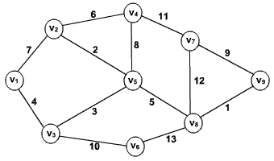

# Graphs

Graphs are data structures comprised of:
* Vertices (dots)- typically the information we try convey with the data structure.
* Edges- connect the vertices, typically represented by lines. The connection between 2 data points in the graph. Can assign weight to graphs and can also assign direction.
 

Sparsity is the relationship between the number of vertices a graph has and the edges. A sparse graph (like Facebook and the relationships between its users) will have many vertices, i.e. Facebook has more than a billion users, but each user can have at most 5000 or so friends, so its a sparse. The measure of it is called **Density**. 

## |V|
* the number of vertices in a graph
## |E|
* the number of edges in a graph

## Density = |E| / |v|(|v| - 1)
* In an un-directed graph, density is at most 1. The minimum density is 0, if there are no edges at all. The graph is denser the closer the density is to 1, and sparser the closer it is to 0.
* In a directed graph, the calculation changes because each vertice has both in and out edges. The number of possible edges is doubled, so the maximum desnsity is 2.

* Density is important in determining the efficienty of algorithms that are applied on graphs. The denser a graph is, the slower the algorithms will be.
* A tree is a graph if it has N vertices(or nodes) and n - 1 edges. Most trees are also therefore graphs. Trees are almost always sprase graphs.

### Difference between directed, undirected, weighted, and unweighted?
* In an undirected graph, the order of vertices in the pairs in the Edge doesn't matter.
* In a directed graph, the order does matter.
* A weighted graph is an edge labeled graph where the labels can be operated on by the usual arithmetic operators, including comparisons like using les than and greater than. The idea is that some edges may be more or less expensive, and the cost is represented by the edge labels or weight.
* Unweighted graph have edges that are not labeled.

### What makes a graph a simple graph? What attributes would make it not simple?
* A simple graph, aka a strict graph, is an unweighted, undirected graph containing no loopsor multiple edges. It can be either connected or unconnected. If any of the conditions aren't met, then the graph is not simple.

## Dependency Set
A list of tasks or events that depened on eachother in some way.
For example, the Vertices will be tasks, and for edges, Task A is connected to Task B IFF Task B depends on Task A. In other words, Task A must be done before Task B. Direction matters and the graph has no cycles. 

